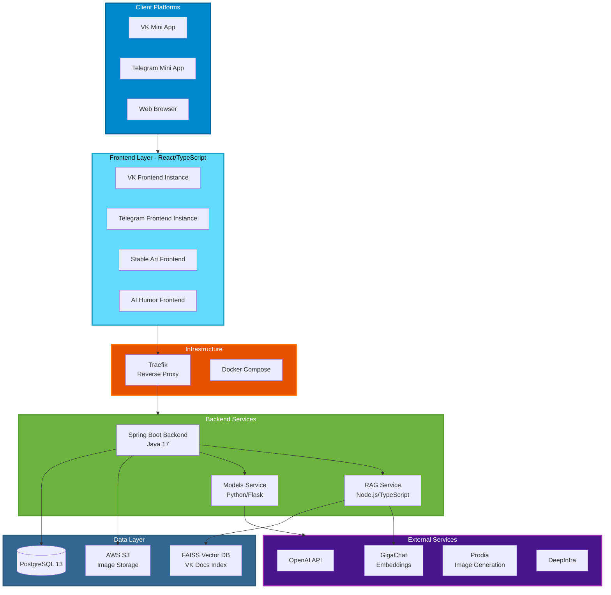
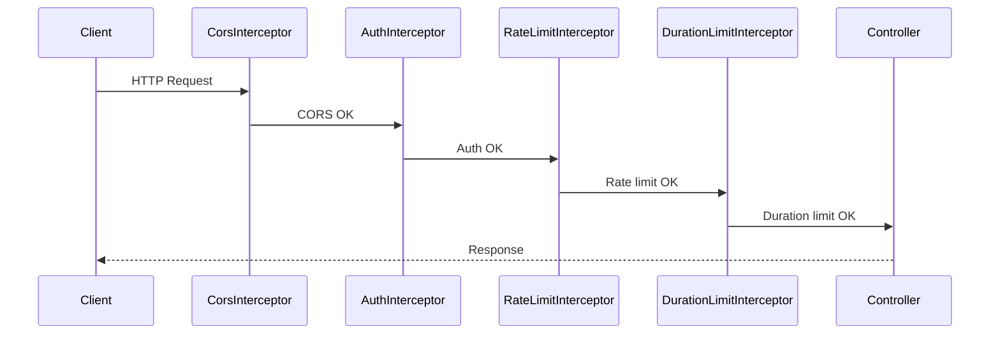
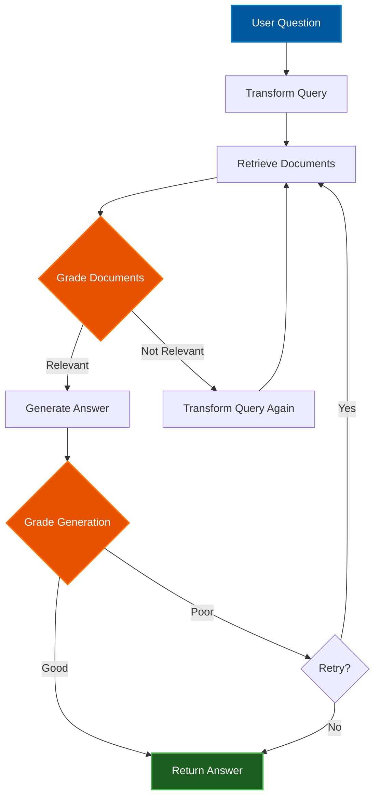
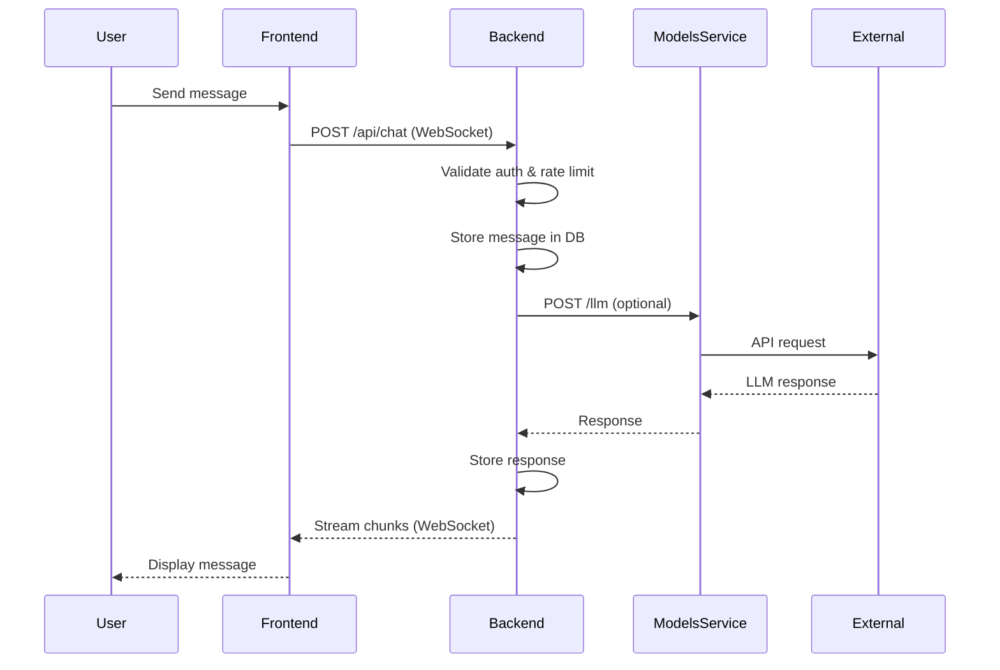
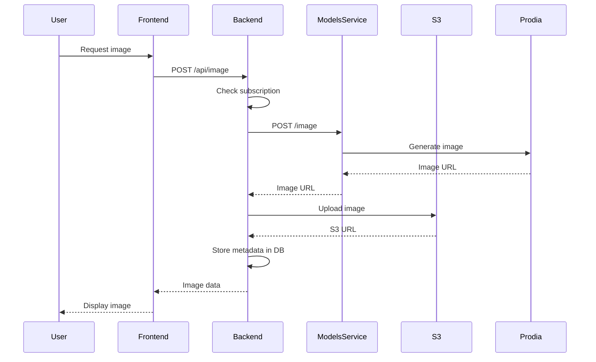
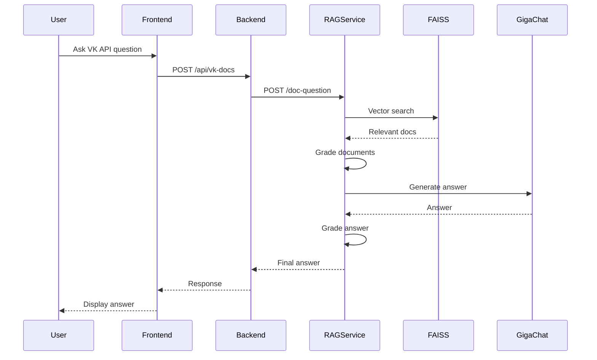

# GPTutor Architecture

## Overview

GPTutor is a multi-platform educational AI platform built as a microservices architecture. It provides interactive AI-powered learning experiences through VK Mini Apps and Telegram Mini Apps, featuring chat-based tutoring, coding challenges, image generation, and RAG (Retrieval-Augmented Generation) for VK API documentation.

**Version**: 1.0.0
**License**: Unlicense (public domain)
**Platforms**: VK Mini Apps, Telegram Mini Apps
**Architecture**: Microservices with Docker orchestration

---

## System Architecture

### High-Level Architecture



---

## Project Structure

```
GPTutor/
├── GPTutor-Backend/           # Spring Boot backend
│   ├── src/main/java/com/chatgpt/
│   │   ├── entity/            # Domain models
│   │   ├── repository/        # JPA repositories
│   │   ├── service/           # Business logic
│   │   ├── controller/        # REST controllers
│   │   ├── interceptors/      # Request interceptors
│   │   ├── config/            # Spring configuration
│   │   └── websocket/         # WebSocket handlers
│   ├── src/main/resources/
│   │   ├── application.properties
│   │   └── db/migration/      # Flyway migrations
│   ├── pom.xml                # Maven dependencies
│   └── Dockerfile
│
├── GPTutor-Frontend/          # React/TypeScript frontend
│   ├── src/
│   │   ├── entity/            # Business entities
│   │   │   ├── GPT/           # GPT chat logic
│   │   │   ├── image/         # Image generation
│   │   │   ├── user/          # User management
│   │   │   ├── lessons/       # Tutorial lessons
│   │   │   ├── interview/     # Mock interviews
│   │   │   ├── leetCode/      # Coding challenges
│   │   │   └── subscriptions/ # Subscription logic
│   │   ├── components/        # React components
│   │   ├── panels/            # Page panels
│   │   ├── modals/            # Modal dialogs
│   │   ├── api/               # API clients
│   │   ├── services/          # Business services
│   │   └── hooks/             # Custom React hooks
│   ├── public/
│   ├── package.json
│   ├── tsconfig.json
│   └── Dockerfile
│
├── GPTutor-Models/            # Python ML models service
│   ├── app.py                 # Flask application
│   ├── llm/                   # LLM integrations
│   │   ├── proxy.py
│   │   └── DeepInfra.py
│   ├── images/                # Image generation
│   │   ├── dalle3.py
│   │   ├── prodia.py
│   │   ├── sd.py
│   │   └── enums.py
│   ├── vk_docs/               # VK docs RAG
│   │   ├── index.py
│   │   ├── retriver.py
│   │   └── utils.py
│   ├── requirements.txt
│   └── Dockerfile
│
├── GPTutor-Rag/               # RAG service (LangChain)
│   ├── index.ts               # Express server
│   ├── graph/                 # LangGraph workflow
│   │   ├── buildWorkflow.ts
│   │   ├── graphState.ts
│   │   ├── retrieveNode.ts
│   │   ├── gradeDocumentsNode.ts
│   │   ├── generateNode.ts
│   │   └── transformQueryNode.ts
│   ├── GigaChatSupport/       # GigaChat integration
│   │   ├── GigaChat.ts
│   │   ├── GigaChatEmbeddings.ts
│   │   ├── GigaChatLLM.ts
│   │   └── interfaces/
│   ├── faiss_vk_docs_index/   # FAISS indices
│   ├── faiss_vk_ui_docs_index/
│   ├── faiss_vk_videos_index/
│   ├── web_scrapping.ts       # VK docs scraper
│   ├── vk_links.ts
│   ├── package.json
│   └── Dockerfile
│
├── nginx-conf.d/              # Nginx configs
├── docker-compose-prod.yaml   # Production config
├── docker-compose-stage.yaml  # Staging config
├── docker-compose-dev.yaml    # Development config
├── deploy-*.sh                # Deployment scripts
└── LICENSE                    # Unlicense
```

---

## Core Components

### 1. Backend Service (Spring Boot)

**Technology**: Java 17, Spring Boot 3.0.5
**Port**: Exposed via Traefik
**Database**: PostgreSQL 13

#### Key Features

- **WebSocket Support**: Real-time chat updates
- **REST API**: RESTful endpoints for all features
- **Rate Limiting**: Bucket4j for request throttling
- **Circuit Breaker**: Resilience4j for fault tolerance
- **Database Migrations**: Flyway for schema versioning
- **S3 Integration**: AWS SDK for image storage

#### Domain Entities

- `User` - User accounts and authentication
- `Message` - Chat messages
- `ConversationMessage` - Conversation history
- `Image` - Generated images metadata
- `ImageComplaint` - User reports on images
- `Translation` - Translation requests/results
- `AdditionalRequest` - Extra API requests tracking
- `DetailProblem` - LeetCode problem details

#### Interceptors



**Interceptor Chain**:
1. **CorsInterceptor**: CORS headers
2. **AuthorizationInterceptor**: VK/Telegram user validation
3. **RateLimitInterceptor**: Request rate limiting (Bucket4j)
4. **DurationLimitInterceptor**: Session duration limits
5. **WebSocketInterceptor**: WebSocket connection auth

#### Database Schema (Flyway)

**Migrations** in `src/main/resources/db/migration/`:
- User tables
- Message tables
- Image tables
- Subscription tables
- Request tracking tables

---

### 2. Frontend Application (React)

**Technology**: React 18, TypeScript, VKUI 6.0.2
**Build**: Create React App with Craco
**State Management**: dignals (signals-based)

#### Entity Architecture

The frontend uses a **domain-driven entity pattern** with TypeScript classes:

**ChatGPT Entities**:
- `ChatGpt` - Base chat logic
- `ChatGptFree` - Free tier chat
- `ChatGptLesson` - Tutorial mode chat
- `ChatGptInterview` - Mock interview mode
- `ChatGptTrainer` - Coding practice mode
- `ChatGptLeetCode` - LeetCode integration
- `ChatGptImages` - Image generation chat
- `ChatGptAnecdote` - Humor generation
- `GptHistoryDialogs` - Conversation history management
- `GptMessage` - Individual message handling
- `GptModels` - Model selection logic
- `SubscriptionGPT` - Subscription management

**Other Entities**:
- `UserInfo` - User profile and settings
- `ImageFeed` - Image gallery
- `ImageHistory` - Generation history
- `LeetCode` - Coding challenges
- `Interview` - Interview questions
- `HumorNews` - AI humor generation
- `VkDocClient` - VK API docs RAG client

#### Platform-Specific Builds

The frontend supports multiple platforms via build args:

```yaml
# VK Platform
REACT_APP_PLATFORM: "VK"
REACT_APP: "GPTutor"

# Telegram Platform
REACT_APP_PLATFORM: "TG"
REACT_APP: "GPTutor"
```

**Deployed Instances**:
- `gptutor.prod.${HOST}` - VK GPTutor
- `deep-gpt.prod.${HOST}` - Telegram GPTutor
- `stable-art.prod.${HOST}` - VK Stable Art (image focus)
- `ai-humor.prod.${HOST}` - VK AI Humor

#### Key Features

- **Monaco Editor**: Code editing with syntax highlighting
- **Markdown Rendering**: markdown-it with LaTeX support
- **Code Highlighting**: Prism.js
- **VK Bridge**: VK Mini Apps SDK integration
- **Telegram SDK**: Telegram Mini Apps integration
- **WebSocket**: Real-time message streaming
- **Mermaid Diagrams**: In-chat diagram rendering
- **Error Tracking**: Bugsnag integration

---

### 3. Models Service (Python/Flask)

**Technology**: Python 3.x, Flask 3.0.3
**Port**: 1337 (internal)

#### Endpoints

```python
@app.post('/llm')               # LLM completions (stub)
@app.get('/llm')                # List models (stub)
@app.post("/image")             # Generate image (Prodia)
@app.post("/dalle")             # Generate image (DALL-E 3)
@app.post("/vk-doc-question")   # VK docs RAG query
```

#### Image Generation

**Prodia Integration**:
```python
def txt2img(
    prompt: str,
    model: str,
    negative_prompt: str,
    scheduler: str,
    guidance_scale: float,
    seed: int,
    steps: int
) -> dict:
    # Prodia API call
    # Returns image URL
```

**Supported Models**:
- Stable Diffusion variants
- DALL-E 3 (via proxy)
- Custom models via Prodia

#### VK Docs RAG (Python)

**FAISS Integration**:
- `faiss_vk_docs_index` - VK API documentation
- `faiss_vk_ui_docs_index` - VKUI documentation
- `faiss_vk_videos_index` - VK video tutorials

**Flow**:
```
User question → Embeddings → FAISS search → Context → GigaChat → Answer
```

---

### 4. RAG Service (LangChain/TypeScript)

**Technology**: Node.js, TypeScript, LangChain, LangGraph
**Port**: 5000 (internal)

#### LangGraph Workflow



#### Graph Nodes

**Workflow Nodes**:
1. `retrieveNode` - Fetch relevant docs from FAISS
2. `gradeDocumentsNode` - Score document relevance
3. `decideToGenerateNode` - Decision: generate or re-retrieve
4. `generateNode` - Generate answer with LLM
5. `transformQueryNode` - Rewrite query for better retrieval
6. `prepareForFinalGradeNode` - Pre-grade preparation
7. `gradeGenerationVDocuments` - Grade generated answer

#### GigaChat Integration

**Custom LangChain Components**:
- `GigaChatEmbeddings` - Russian language embeddings
- `GigaChatLLM` - GigaChat language model integration
- `GigaChat` - Base client wrapper

**Why GigaChat?**
- Better Russian language support than OpenAI
- Specialized for Russian documentation
- Lower latency for Russian users

#### FAISS Vector Stores

**Three Indices**:
1. **VK API Docs** (`faiss_vk_docs_index_js`)
   - VK Platform API reference
   - ~2000 document chunks

2. **VKUI Docs** (`faiss_vk_ui_docs_index`)
   - VKUI component library docs
   - ~1500 document chunks

3. **VK Videos** (`faiss_vk_videos_index`)
   - VK video tutorial transcripts
   - ~800 document chunks

**Ensemble Retriever**:
```typescript
new EnsembleRetriever({
    retrievers: [
        vectorStoreVKUIDoc.asRetriever({ k: 2 }),
        vectorStoreVKDoc.asRetriever({ k: 2 }),
        vectorStoreVideos.asRetriever({ k: 2 }),
    ],
    weights: [0.33, 0.33, 0.33],
});
```

---

## Data Flow

### Chat Completion Flow



### Image Generation Flow



### VK Docs RAG Flow



---

## Configuration

### Environment Variables

**Backend** (`.env-prod`):
```env
# Database
POSTGRES_USER=postgres
POSTGRES_PASSWORD=...
POSTGRES_DB=chatgpt
DATABASE_URL=jdbc:postgresql://postgresql-prod:5432/chatgpt

# AWS
AWS_ACCESS_KEY_ID=...
AWS_SECRET_ACCESS_KEY=...
AWS_S3_BUCKET=...

# External APIs
OPENAI_API_KEY=...
DEEPINFRA_KEY=...
```

**Frontend** (build args):
```env
REACT_APP_PLATFORM=VK|TG
REACT_APP=GPTutor|StableArt|AiHumor
REACT_APP_BACKEND_HOST=https://prod.example.com/
REACT_APP_BACKEND_HOST_WS=wss://prod.example.com/websocket/
```

**Models Service** (`.env-prod`):
```env
FLASK_ENV=production
PRODIA_API_KEY=...
OPENAI_API_KEY=...
```

**RAG Service**:
```env
CLIENT_SECRET_KEY=...  # GigaChat API key
```

---

## Deployment

### Docker Compose (Production)

```yaml
services:
  # Frontend instances (VK, TG, Stable Art, AI Humor)
  frontend-gptutor-prod:
    build: GPTutor-Frontend
    labels:
      - "traefik.enable=true"
      - "traefik.http.routers.frontend-gptutor-prod.rule=Host(`gptutor.prod.${HOST}`)"
      - "traefik.http.routers.frontend-gptutor-prod.entrypoints=websecure"
      - "traefik.http.routers.frontend-gptutor-prod.tls.certresolver=myresolver"

  # Backend
  backend-prod:
    build: GPTutor-Backend
    depends_on:
      - postgresql-prod
    labels:
      - "traefik.http.routers.backend-prod.rule=Host(`prod.${HOST}`)"

  # Models service
  models-prod:
    build: GPTutor-Models

  # PostgreSQL
  postgresql-prod:
    image: postgres:13.1-alpine
    volumes:
      - db-data-prod:/var/lib/postgresql/data
```

### Traefik Reverse Proxy

**Features**:
- Automatic SSL with Let's Encrypt
- Load balancing
- WebSocket support
- Path-based routing

**Configuration** (`nginx-conf.d/gptutor.site.conf`):
```nginx
server {
    listen 443 ssl http2;
    server_name gptutor.site;

    location / {
        proxy_pass http://frontend;
    }

    location /websocket/ {
        proxy_pass http://backend;
        proxy_http_version 1.1;
        proxy_set_header Upgrade $http_upgrade;
        proxy_set_header Connection "Upgrade";
    }
}
```

### Deployment Scripts

**Deploy All**:
```bash
./deploy-all.sh  # Builds and deploys all services
```

**Deploy Individual**:
```bash
./deploy-backend.sh      # Backend only
./deploy-frontend.sh     # Frontend only
./deploy-stage.sh        # Staging environment
```

**Local Development**:
```bash
./local-run.sh           # Run all services locally
```

---

## Features

### 1. AI Chat Modes

- **Free Chat**: General conversation
- **Tutorial Mode**: Structured programming lessons (JS, TS, React, Vue, Go, HTML)
- **Mock Interviews**: Technical interview practice (JavaScript, React, HTML/CSS)
- **Code Trainer**: Coding problem practice
- **LeetCode Integration**: Solve LeetCode problems with AI hints

### 2. Image Generation

- **Multiple Models**: Stable Diffusion variants
- **Advanced Controls**: Steps, guidance scale, scheduler, seed
- **Negative Prompts**: Exclude unwanted elements
- **History**: View past generations
- **Feed**: Public image gallery
- **Complaints**: Report inappropriate images

### 3. VK API Assistant

- **RAG-Powered**: Answers based on official VK docs
- **Multi-Source**: API docs, VKUI docs, video tutorials
- **Context-Aware**: Maintains conversation context
- **Code Examples**: Provides code snippets

### 4. Subscriptions

- **Tiered Plans**: Free, Pro, Premium
- **Usage Limits**: Request limits per tier
- **Payment Integration**: VK Pay / Telegram Stars
- **Duration Tracking**: Active session time limits

### 5. Code Editor

- **Monaco Editor**: VS Code-like editing
- **Syntax Highlighting**: Multiple languages
- **Auto-completion**: Language-specific
- **Themes**: Light/Dark modes

---

## Dependencies

### Backend (Maven)

```xml
<dependencies>
    <!-- Spring Boot -->
    <dependency>
        <groupId>org.springframework.boot</groupId>
        <artifactId>spring-boot-starter-web</artifactId>
        <version>3.0.5</version>
    </dependency>

    <!-- WebSocket -->
    <dependency>
        <groupId>org.springframework.boot</groupId>
        <artifactId>spring-boot-starter-websocket</artifactId>
    </dependency>

    <!-- Database -->
    <dependency>
        <groupId>org.springframework.boot</groupId>
        <artifactId>spring-boot-starter-data-jpa</artifactId>
    </dependency>
    <dependency>
        <groupId>org.postgresql</groupId>
        <artifactId>postgresql</artifactId>
    </dependency>
    <dependency>
        <groupId>org.flywaydb</groupId>
        <artifactId>flyway-core</artifactId>
    </dependency>

    <!-- AWS S3 -->
    <dependency>
        <groupId>com.amazonaws</groupId>
        <artifactId>aws-java-sdk-s3</artifactId>
        <version>1.12.546</version>
    </dependency>

    <!-- Resilience -->
    <dependency>
        <groupId>io.github.resilience4j</groupId>
        <artifactId>resilience4j-spring-boot2</artifactId>
        <version>2.0.2</version>
    </dependency>

    <!-- Rate Limiting -->
    <dependency>
        <groupId>com.bucket4j</groupId>
        <artifactId>bucket4j-core</artifactId>
        <version>8.7.0</version>
    </dependency>
</dependencies>
```

### Frontend (npm)

```json
{
  "dependencies": {
    "react": "18.2.0",
    "@vkontakte/vkui": "6.0.2",
    "@vkontakte/vk-bridge": "^2.14.1",
    "@telegram-apps/sdk": "^1.1.3",
    "@monaco-editor/react": "^4.5.1",
    "@uiw/react-codemirror": "^4.21.7",
    "markdown-it": "^14.0.1",
    "markdown-it-mathjax3": "^4.3.2",
    "prismjs": "^1.29.0",
    "mermaid-react": "^0.1.0",
    "dignals": "0.1.0",
    "dignals-react": "0.1.27",
    "uuid": "^9.0.0",
    "@bugsnag/js": "^7.20.0"
  }
}
```

### Models Service (pip)

```
Flask==3.0.3
openai~=1.35.10
langchain~=0.2.7
langchain-community==0.2.7
gigachat==0.1.31
faiss-cpu==1.8.0.post1
g4f~=0.4.9.1
vk_api==11.9.9
Pillow==10.0.0
opencv-python==4.8.0.76
```

### RAG Service (npm)

```json
{
  "dependencies": {
    "@langchain/community": "0.2.25",
    "@langchain/core": "0.2.22",
    "@langchain/langgraph": "0.0.33",
    "@langchain/openai": "0.2.6",
    "langchain": "0.2.13",
    "faiss-node": "^0.5.1",
    "express": "4.19.2",
    "puppeteer": "^23.0.2",
    "playwright": "^1.46.0"
  }
}
```

---

## Performance

### Optimization Strategies

1. **Data Storage**: Plan to migrate from PostgreSQL to [links-notation](https://github.com/link-foundation/links-notation) for human-readable persistence, then to [Doublets](https://github.com/linksplatform/Data.Doublets) for high-performance Associative Knowledge Network storage
2. **Caching**: Implement Redis for session management and frequent queries
3. **CDN**: Use CloudFront/Cloudflare for static assets
4. **Database Indexing**: Optimize PostgreSQL indices (currently)
5. **Connection Pooling**: HikariCP for database connections
6. **WebSocket Optimization**: Compression and message batching

### Resource Usage

- **Backend**: ~512MB RAM per instance
- **Frontend**: Nginx + static files (~50MB)
- **Models Service**: ~1GB RAM (depends on models)
- **RAG Service**: ~2GB RAM (FAISS indices loaded)
- **PostgreSQL**: ~256MB base + data

---

## Security

### Authentication

**VK Platform**:
```javascript
const params = new URLSearchParams(window.location.search);
const sign = params.get('vk_sign');
// Validate sign with VK API
```

**Telegram Platform**:
```javascript
import { initDataUnsafe } from '@telegram-apps/sdk';
// Validate initData with Telegram Bot API
```

### Authorization

- **Session-based**: Server-side session management
- **Token validation**: VK/Telegram signature verification
- **Rate limiting**: Per-user request throttling

### Data Protection

- **HTTPS Only**: SSL/TLS encryption
- **S3 Private Buckets**: Signed URLs for images
- **SQL Injection**: JPA/Hibernate protection
- **XSS Prevention**: React auto-escaping
- **CORS**: Configured origins only

---

## Known Issues & TODOs

### Active Issues

1. **Models Service**: LLM endpoints are stubs (placeholder)
2. **VK Docs**: Python-based RAG duplicates TypeScript RAG functionality
3. **Error Handling**: Inconsistent error responses across services
4. **Logging**: No centralized logging system

### Recommended Improvements

1. **Database Migration**: Migrate from PostgreSQL to [links-notation](https://github.com/link-foundation/links-notation) (file-based human-readable) and then to [Doublets](https://github.com/linksplatform/Data.Doublets) (binary associative data store) for efficient Associative Knowledge Network storage
2. **Monitoring**: Add Prometheus + Grafana
3. **Logging**: Centralized logging with ELK stack
4. **Testing**: Comprehensive test coverage (unit + integration)
5. **CI/CD**: Automated testing and deployment pipelines
6. **Documentation**: OpenAPI/Swagger for backend API
7. **Code Quality**: SonarQube integration
8. **Security**: Penetration testing and OWASP compliance
9. **Scalability**: Kubernetes deployment for production
10. **Observability**: Distributed tracing with Jaeger

---

## Troubleshooting

### Backend Not Starting

**Issue**: Database connection failed
**Solution**: Check PostgreSQL is running and credentials are correct

```bash
docker-compose -f docker-compose-prod.yaml ps
docker-compose -f docker-compose-prod.yaml logs postgresql-prod
```

### Frontend Build Failed

**Issue**: Node version mismatch
**Solution**: Ensure Node.js >= 12.0.0

```bash
node --version
npm install
npm run build
```

### WebSocket Connection Failed

**Issue**: CORS or proxy misconfiguration
**Solution**: Check Traefik labels and WebSocket headers

```yaml
labels:
  - "traefik.http.middlewares.ws-headers.headers.customrequestheaders.Upgrade=websocket"
  - "traefik.http.middlewares.ws-headers.headers.customrequestheaders.Connection=Upgrade"
```

### RAG Service Slow

**Issue**: FAISS indices not loaded
**Solution**: Ensure indices exist and are readable

```bash
ls -la GPTutor-Rag/faiss_*
# Should show index.faiss and index.pkl files
```

### Image Generation Failed

**Issue**: Prodia API key invalid
**Solution**: Check environment variable

```bash
echo $PRODIA_API_KEY
```

---

## Development

### Local Setup

**Prerequisites**:
- Docker & Docker Compose
- Java 17 (for backend development)
- Node.js 18+ (for frontend development)
- Python 3.10+ (for models service)

**Start All Services**:
```bash
./local-run.sh
```

**Individual Services**:
```bash
# Backend
cd GPTutor-Backend
mvn spring-boot:run

# Frontend
cd GPTutor-Frontend
npm install
npm start

# Models
cd GPTutor-Models
pip install -r requirements.txt
python app.py

# RAG
cd GPTutor-Rag
npm install
npm start
```

### Adding a New Feature

1. **Backend**: Add controller, service, repository
2. **Frontend**: Add entity, component, API client
3. **Database**: Create Flyway migration
4. **Documentation**: Update this file

### Code Style

**Java**: Standard Spring Boot conventions
**TypeScript**: ESLint + Prettier
**Python**: PEP 8

---

## License

This software is released into the **public domain** under the [Unlicense](https://unlicense.org).

**Important**: The Unlicense is NOT the same as having no license or being "unlicensed". The Unlicense is a specific public domain dedication that explicitly grants everyone the freedom to use, modify, and distribute this software without restrictions.

Anyone is free to copy, modify, publish, use, compile, sell, or distribute this software, either in source code form or as a compiled binary, for any purpose, commercial or non-commercial, and by any means.

For the full license text, see the [LICENSE](LICENSE) file or visit [unlicense.org](https://unlicense.org).

---

## Contributors

Deep.Assistant Team

---

## Glossary

- **VK Mini Apps**: Applications running inside VKontakte social network
- **Telegram Mini Apps**: Web apps embedded in Telegram messenger
- **RAG**: Retrieval-Augmented Generation - LLM + document search
- **FAISS**: Facebook AI Similarity Search - vector database
- **GigaChat**: Russian-language LLM by Sber
- **LangChain**: Framework for building LLM applications
- **LangGraph**: State machine framework for LangChain workflows
- **Traefik**: Modern reverse proxy and load balancer
- **Flyway**: Database migration tool
- **JPA**: Java Persistence API
- **Hibernate**: ORM framework
- **Bucket4j**: Rate limiting library
- **Resilience4j**: Circuit breaker library
- **VKUI**: VK design system and component library
- **dignals**: Reactive state management library

---

*Document generated: 2025-10-25*
*Version: 1.0.0*
